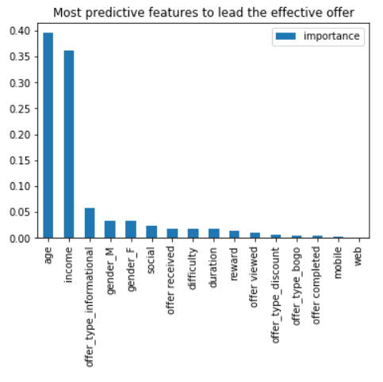

# starbuck_challenge

Starbuck wants to know how do the 3 types of promtions work through their mobile app. Knowing better about their customers to be able to change their strategy.
# Table of Content
1. [Project Overview](#project)
2. [Dataset Overview](#dataset)
3. [Steps](#steps)
4. [Model Choose](#model)
5. [Summary](#summary)

## Project Overview
Customer satisfaction drives business success and data analytics provides insight into what customers think. For example, the phrase "[360-degree customer view](https://searchsalesforce.techtarget.com/definition/360-degree-customer-view)" refers to aggregating data describing a customer's purchases and customer service interactions.
  
The Starbucks [Udacity Data Scientist Nanodegree](https://www.udacity.com/course/data-scientist-nanodegree--nd025) Capstone challenge data set is a simulation of customer behavior on the Starbucks rewards mobile application. Periodically, Starbucks sends offers to users that may be an advertisement, discount, or buy one get on free (BOGO). An important characteristic regarding this dataset is that not all users receive the same offer.
  
This data set contains three files. The first file describes the characteristics of each offer, including its duration and the amount  a customer needs to spend to complete it (difficulty). The second file contains customer demographic data including their age, gender, income, and when they created an account on the Starbucks rewards mobile application. The third file describes customer purchases and when they received, viewed, and completed an offer. An offer is only successful when a customer both views an offer and meets or exceeds its difficulty within the offer's duration.

## Dataset overview
The program used to create the data simulates how people make purchasing decisions and how those decisions are influenced by promotional
offers. Each person in the simulation has some hidden traits that influence their purchasing patterns and are associated with their 
observable traits. People produce various events, including receiving offers, opening offers, and making purchases.

As a simplification, there are no explicit products to track. Only the amounts of each transaction or offer are recorded.
There are three types of offers that can be sent: buy-one-get-one (BOGO), discount, and informational. In a BOGO offer, a user needs to 
spend a certain amount to get a reward equal to that threshold amount. In a discount, a user gains a reward equal to a fraction of the 
amount spent. In an informational offer, there is no reward, but neither is there a requisite amount that the user is expected to spend. Offers can be delivered via multiple channels.

The basic task is to use the data to identify which groups of people are most responsive to each type of offer, and how best to present 
each type of offer.

## Steps  
1. Access, Clean and Analyze Data

This step involves Data cleaning process and Classification based on different group of users.
2. Training Data and Models
In starbuck case, what I like to predict is whether the promotion offer will be efficient for certain users. It is a binary classification problem.

The target will be the efficient offer.

The features to train will be the other features in the data, include the users demographic characteristics and also the offer duration, type, offer channels, etc.

I defined the dataset as labeled data, so we will use supervised learning models.

What I want to predict is a categorical form, will be YES or NO, 1 or 0.
The target will be the efficient offer.

## Model Choose

I tried following 4 model to check which model have high accuracy
1. Decision Tree model
2. Random forest model
3. Gradient boosting model
4. Adaboost model

Decision Tree and Random Forest models work better in this case, I will select this both models to tone them by adjust their parameters.

# Summary

### The most predictive that the feature can be effient is 'age', 'income', and 'difficuty' of the offer.
